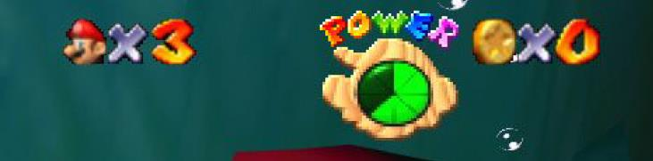

# Pràctica 3: Super Mario 64

## Objectiu

Desenvolupament d’un videojoc estil Mario 64 amb el motor Unity 3D.

## Metodologia

El desenvolupament d’aquesta pràctica es farà en grups de 2 alumnes. No es permetrà
l’entrega individual. Cal utilitzar la versió de Unity3D 2022.3.30f1.

## Parts a desenvolupar

- [x] **Escenari (_0.5p_):** Utilitzant els assets pujats a l’eCampus s’haurà de crear un escenari jugable que s’adapti a les necessitats dels següents punts creant un nivell amb gameplay a l’estil de Mario 64.
- [ ] **Controlador de personatge (_1p_):** El nostre personatge principal haurà de tenir un comportament similar al que tenia el joc original però amb algunes limitacions. S’haurà d’implementar els estats de: Idle, Walk, Run, Fall, Jump, Double Jump, Triple Jump, Long Jump, Wall Jump, Punch1, Punch2, Punch3, Hit, Die. Probablement es necessiten més estats intermitjos per poder permetre tots aquests comportaments. 
      - [x] Idle 
      - [x] Walk 
      - [x] Run 
      - [x] Fall 
      - [x] Jump
            - [x] Jump 
            - [x] Double Jump 
            - [x] Triple Jump 
      - [x] Long Jump -> do a crouch controller and when crouching, movement != 0 and jump does a long jump
      - [ ] Wall Jump 
      - [x] Punch 1 
      - [x] Punch 2 
      - [x] Punch 3 
      - [ ] Hit 
      - [ ] Die
- [x] **Càmera (_1p_):** La càmera haurà de comportar-se com en el joc original. Mario es mourà rotant sobre l’eix de la càmera, i aquesta haurà de moure’s fins a una distància màxima sempre sobre l’eix d’aquest. Amb l’extra de que no es pot ficar dins de la geometria de l’escenari. Si una paret bloqueja el moviment que desitgem aconseguir, la càmera haurà d’adaptar-se per col·locar-se en la posició més propera al punt on volem posar-la, però respectant el no entrar dins de la geometria.
- [x] **Plataformes (_0.5p_):** Haurà d’haver 2 tipus de plataformes mòbils. Una basada en físiques que hauran de comportar-se com un balancí (vídeo). Altre hauria de girar seguint una forma d’oval (vídeo). 
- [x] **Items (_1p_):** Mario haurà de poder recollir monedes i cors. Les monedes es sumaran a mesura que es recullin, i els cors sumaran porcions de vida. (No és el mateix comportament que en el joc original).
- [ ] **Enemics - Seta (_1p_):** Els goombas hauran d’estar distribuïts per l’escenari i tenir un comportament de patrol on el que estaran passejant i un estat d’alert on si veuen a Mario dins d’un cert radi d’acció aniran directament fins a ell per tocar-li. Mentre estiguin tocant a Mario perdrem una unitat de vida per segon. Si Mario salta a sobre d’ells, els goombas moriran a l’instant.
      
- [x] **HUD (_1p_):** En aquest moment haurem de poder veure les vides restants i la quantitat de monedes que tenim. L’indicador de vida, només haurà d’aparèixer des de dalt quan Mario perdi una porció de vida o quan se li regeneri. Una vegada mostrada haurà de tornar a amargar-se.
      
- [ ] **Game Over / Restart (_1p_):** Quan el player mori sortirà una pantalla de Game Over i se li donarà la possibilitat de tornar a intentar-ho. Mentre li quedin vides haurà de poder tornar a començar el nivell.

### BONUS POINTS (_màxim 3 punts_)

Aquest punt només s’avaluaran si s’han implementat tota la resta de punts. Completa el nivell amb els següents punts:

- [ ] **Dead zones (_0.5p_):** En l’escenari haurà zones de lava que mataran al Player automàticament si el Player les toca.
- [ ] **Checkpoint (_0.5p_):** Una vegada superades certes zones, passarem checkpoints que ens permetrà si morim continuar la partida des d’aquest punt.
      
- [ ] **Sound (_0.5p_):** Sonoritzar el joc. Tots els salts, cops, impactes, morts, monedes, cors...
- [ ] **Partícules (_0.5p_):** Afegir sistemes de partícules a certes accions del joc com córrer, morir, ítems,…
- [ ] **Enemics – Tortuga (_1.5p_):** Aquest haurà de comportar-se amb el mateix
      comportament que la Seta però quan mori deixarà una closca. Aquest haurà de poder agafar-se i llençar-se. Si es trepitja haurà de sortir disparat i rebotarà amb l’escenari. La closca mata als enemics si els toca i a Mario, anirà perdent vida fins parar-se. Si està en moviment i toca a Mario, aquest rebrà un impacte. Per a implementar-se haurà d’afegir-se els estats de take i throw en el Mario.
- [ ] **Better càmera (_0.5p_):** Si el player està parat durant 5 segons la càmera es col·locarà automàticament just darrere de Mario.
- [ ] **Special Idle (_0.5p_):** Si estic en Idle durant 10 segons o més, Mario executarà una animació extra sense sortir de l’estat d’Idle.
- [ ] **Gamepad (_0.5p_):** Adaptar el joc per a que pugui ser jugat amb un gamepad.

## Entrega

L’entrega es farà penjant un arxiu de text (txt) a la tasca corresponent de l’aula virtual abans de les 23:59 del 15 de Desembre. Només cal fer una entrega per grup. L’arxiu ha d’incloure:

- Un enllaç (wetransfer) amb la carpeta del projecte de Unity. El nom de l’arxiu a
  descarregar cal que sigui 3DP3_CognomNom1_CognomNom2.zip.
- Noms dels membres del grup i llistat de les parts desenvolupades
- Enllaç a un vídeo de youtube on es vegin tots els punts desenvolupats. Exemple de
  video: https://youtu.be/D0PSJy2thnM

## Avaluació

No s’acceptarà cap entrega fora del termini establert, que no compili, o no compleixi algunes de les condicions especificades a l’apartat entrega (format o contingut del fitxer). Cada part a desenvolupar s’avaluarà amb una de les següents puntuacions:

- 0%: no funciona correctament.
- 50%: funciona correctament.
- 100%: funciona correctament i s’ha implementat seguint les millors pràctiques
  explicades a classe (codi intel·ligible, reutilitzable, principis SOLID, patrons, etc.) i els recursos elegits, i la implementació i parametrització dels scripts incrementen la jugabilitat global de joc.
